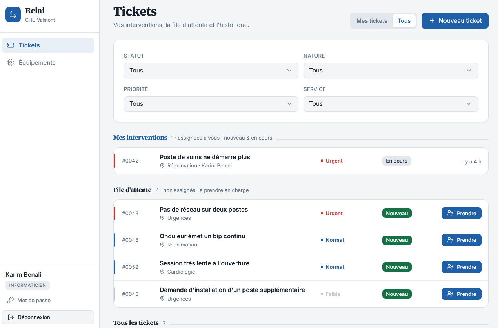
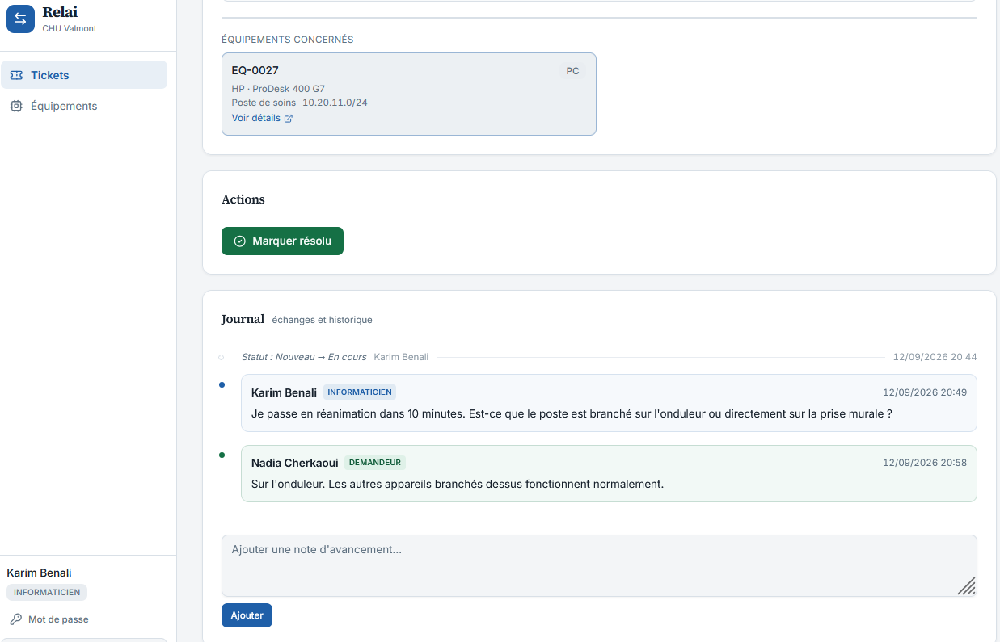
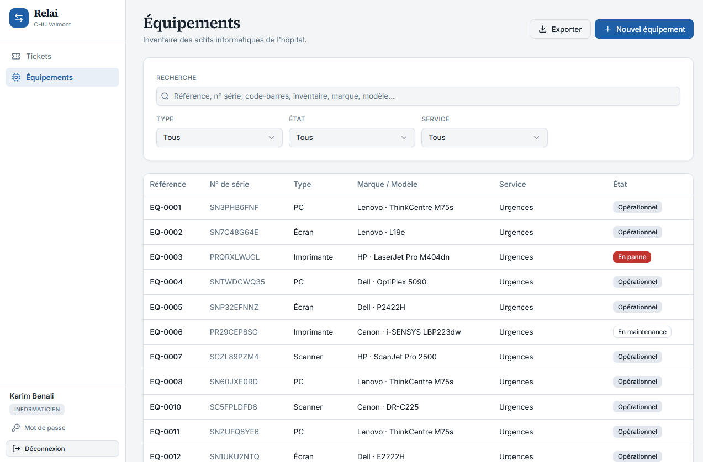
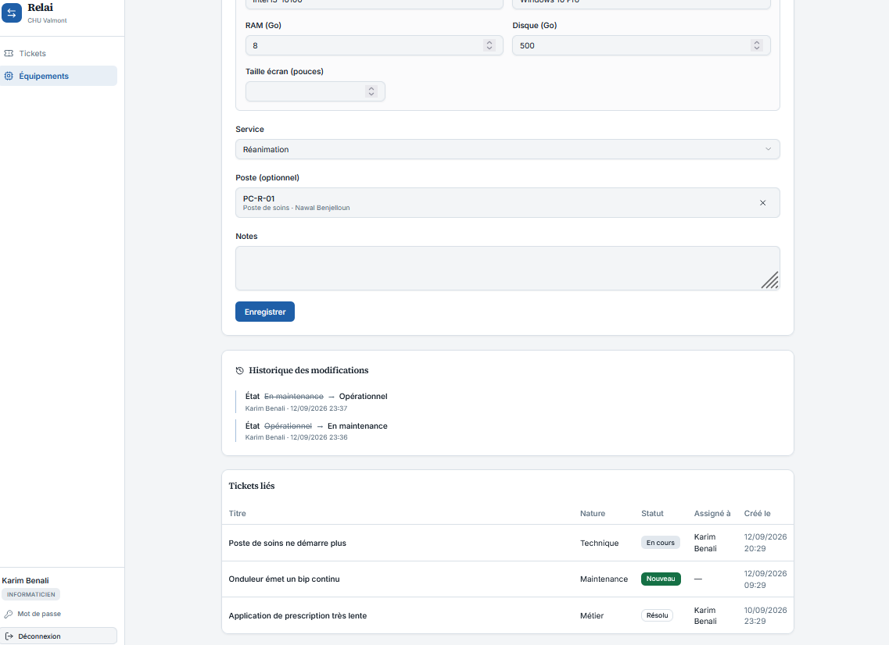

# Relai

An IT helpdesk and asset-inventory system for a hospital's internal computing
unit. Technicians track workstations, printers and network kit across the
wards; medical staff report a fault in three clicks and the server decides how
urgent it is.

**Stack:** React 19 + TypeScript · FastAPI + async SQLAlchemy · PostgreSQL 16 ·
Docker + NGINX

> **Relai** — application de gestion de parc informatique et de tickets pour
> l'unité informatique d'un hôpital. Interface en français, documentation
> technique en anglais.

> **All data in this repository is synthetic.** The hospital, its services,
> staff, workstations, serial numbers and asset tags are invented and generated
> from a fixed random seed. This is a portfolio copy of a system that was built
> for, and deployed to, a real hospital IT unit; nothing identifying that
> deployment is included here.

---

## The application

https://github.com/user-attachments/assets/db3fae98-9ea0-4e02-b9fe-26ee690005e9

A nurse in Réanimation reports a fault in three clicks. She never sees a
priority field: the server scores it from her service's criticality, the kind
of problem and the class of equipment affected. It reaches the technician's
queue already marked **Urgent** — and nobody chose that.



*The technician's day. Their own interventions, the unassigned pool, then
everything else — one row shape across all three, so the same ticket reads the
same way wherever you meet it. Priority owns the rail, status owns the badge.*



*A ticket's timeline, in two tracks. Typed comments are cards, tinted by which
side of the hospital wrote them; status changes and reassignments are the thin
italic entries, written by the server so that typing one into the comment box
cannot forge it.*



*The asset register — 228 items across 14 services in the demo seed.
Filterable by type, state, service, room and subnet, and searchable across
every identifier. Exports to Excel for the annual inventory count.*



*Every asset carries its own history: which tickets it appeared in, and a
field-level audit of every change — who moved it, when, and from what to what.
"How many times has this printer failed this year" is a query, not an
archaeology exercise.*

---

## Design decisions

Four choices that came out of the constraints of the real deployment:

**Priority is computed, never claimed.** A demandeur (nurse, secretary, ward
staff) cannot set a ticket's priority — the classic failure mode where
everything arrives marked *urgent*. Instead the server scores it from three
signals: the criticality the admin assigned to that service, the category of
problem, and the class of equipment affected. See
[`app/services/priority.py`](backend/app/services/priority.py). The urgent
threshold is deliberately set so that a routine hardware fault in an
unconfigured service stays *normal* — only services an admin explicitly marked
critical can push a ticket to urgent.

**The intake form is shaped by who's filling it.** A demandeur picks a problem
category and optionally one affected device; the server derives the title,
description, service and priority from the workstation their account is pinned
to. Technicians get the full form. Two endpoints, one ticket table.

**Tickets are linked to assets, not just to text.** A ticket references the
specific equipment involved through a many-to-many relation, plus the
workstation where it happened. "How many times has this printer failed this
year" is a query, not an archaeology exercise.

**It runs on a 1.5 GB VM behind a hospital firewall.** Tuned Postgres, a static
frontend bundle instead of a dev server, offline image transfer for an
air-gapped network, and a Vite build target of `es2018 / firefox60` because
some technicians run Basilisk, a UXP browser fork that can't parse modern
syntax. See the comment in [`vite.config.ts`](frontend/vite.config.ts).

---

## Architecture

```
Browser
  └── NGINX  :443 (TLS)          ← reverse proxy, rate limiting, CSP
        │      :80 → 301 https
        ├── /api/*  → FastAPI (uvicorn, 2 workers)   internal network only
        └── /*      → static React bundle

FastAPI
  └── PostgreSQL 16                                  internal network only
```

Only NGINX is published. The database and API sit on an internal Docker
network and are not reachable from the host.

---

## Roles

Three roles, enforced server-side by a dependency factory
([`deps.py`](backend/app/api/v1/deps.py)) and mirrored in the router guards.

| Role | Scope |
|---|---|
| `admin` | Everything: users, services, workstations, inventory. Assigns tickets to anyone, cancels, closes, archives, reopens closed tickets. |
| `informaticien` | Inventory CRUD and ticket work. Can only assign tickets **to themselves**, and only act on tickets assigned to them. |
| `demandeur` | Reports faults through the simplified form. Sees and comments on **only their own** tickets. Pinned to one workstation. |

```python
current_user: User = Depends(require_admin)           # admin only
current_user: User = Depends(require_informaticien)   # admin or informaticien
current_user: User = Depends(get_current_user)        # any authenticated
```

---

## Ticket lifecycle

```
                ┌──────────────► annulé ──────────┐
                │                                 │  (admin)
   nouveau ──► en_cours ──► résolu ──► clôturé    │
      ▲            ▲           │          │       │
      │            └───────────┘          │       │
      │             reopen (assigned      │       │
      │             tech or admin)        │       │
      └───────────────────────────────────┴───────┘
                    reopen (admin only)
```

Transitions are validated against an explicit table, with a permission rule
per edge — see `TRANSITIONS` in
[`endpoints/tickets.py`](backend/app/api/v1/endpoints/tickets.py). Terminal
states are re-openable on purpose: "it broke again" is normal, and forcing a
duplicate ticket would discard the history of what was already tried.

Status changes and reassignments are written to the ticket timeline by the
server as typed entries (`kind = statut | assignation`), separate from typed
comments (`kind = commentaire`), so the audit trail can't be forged by typing
into the comment box.

---

## Auth

```
POST /api/v1/auth/login    → { access_token, refresh_token }
POST /api/v1/auth/refresh  → rotated pair, re-checks the account is still active
GET  /api/v1/auth/me       → current user
```

The **access token is held in memory only** (Zustand, not persisted). Only the
refresh token and cached user survive a reload; the axios interceptor
exchanges the refresh token for a new access token on the first 401, with
concurrent requests parked in a queue behind a single refresh.

An absent or invalid bearer token returns **401** with `WWW-Authenticate`, not
FastAPI's default 403 — both because RFC 6750 says so and because the
frontend's refresh flow keys on 401.

---

## Running it locally

```bash
cp .env.example .env      # fill in POSTGRES_PASSWORD and SECRET_KEY
docker compose up -d

docker compose exec backend python seed.py             # admin + 14 services
docker compose exec backend python seed_inventaire.py  # 80 workstations, 228 assets
docker compose exec backend python seed_demo.py        # 5 accounts + 12 tickets
```

Then open http://localhost.

`scripts/setup.sh` (or `scripts/setup.ps1` on Windows) wraps the same steps.

### Demo accounts

All use the password `demo1234`. Each role sees a genuinely different
application, so it's worth signing in as more than one.

| Role | Email | What you see |
|---|---|---|
| Admin | `admin@chu-valmont.fr` | Everything: users, services, workstations, inventory, archive |
| Technicien | `karim@chu-valmont.fr` | The triage queue, inventory, tickets assigned to them |
| Technicien | `salma@chu-valmont.fr` | Same, with a different workload |
| Ward staff | `nadia@chu-valmont.fr` | The three-click report form and their own tickets only |
| Ward staff | `youssef@chu-valmont.fr` | Same, pinned to a different service |

`seed_demo.py --reset` wipes the demo accounts and their tickets and rebuilds
them, so a demo can be handed back to a clean state.

In development only, the app bootstraps its schema with
`Base.metadata.create_all` on startup. In production the schema is Alembic's
job and startup never touches it.

---

## Tests

```bash
docker compose -f docker-compose.test.yml run --rm tests   # backend — 112
cd frontend && npm test                                    # frontend — 24
```

**Backend: 112 tests**, against a real PostgreSQL rather than SQLite — the
models depend on Postgres UUID and native enum types and on server-side
defaults, so SQLite would pass things production rejects. They cover token
handling and the ways it can be abused (type confusion, forged subjects,
deactivated accounts), role permissions on every endpoint, the ticket state
machine including each reopen path, priority scoring boundaries and
pagination, inventory filtering and identifier uniqueness, the cross-service
workstation rule, the equipment audit log, archive versus permanent deletion,
the spreadsheet export, and both password-change paths.

**Frontend: 24 tests** (Vitest) on the pieces where a mistake is silent: the
role hierarchy in the route guard, the API error extractor — including the
validation-error shape that used to render as `[object Object]` — and the
formatting helpers, checked to read theme tokens rather than literal colours,
since hardcoded ones once survived a palette change and clashed with
everything around them.

There are no mocked-API component tests. The endpoints are covered for real
against Postgres by the backend suite; repeating that here with mocks would
mostly test the mocks.

---

## Migrations

Schema changes go through Alembic.

```bash
scripts/migrate.sh new "describe what changed"   # autogenerate a revision
# review the generated file, then commit it
scripts/migrate.sh                               # alembic upgrade head
scripts/migrate.sh status                        # current revision + history
scripts/migrate.sh down                          # roll back one revision
```

CI runs `alembic check` on every push, which fails the build if a model was
changed without a matching migration.

> Autogenerate is good but not perfect — review the file, especially for
> Postgres enum changes and column renames.

---

## Deployment

The step-by-step procedure is [docs/DEPLOY_DAY.md](docs/DEPLOY_DAY.md). Summary:

`docker-compose.prod.yml` overlays the dev stack to:

- serve the frontend as a static bundle from its own nginx (~50 MB instead of
  ~300 MB for a Vite dev server),
- run uvicorn with 2 workers and no `--reload`,
- tune Postgres for ~1.5 GB RAM (`shared_buffers=128MB`, `work_mem=4MB`,
  `effective_cache_size=512MB`, `max_connections=50`),
- terminate TLS on 443 with a strict CSP, redirecting port 80,
- set `restart: always` everywhere.

```bash
cp .env.production.example .env
nano .env                  # replace every GENERATE_ME_* value
scripts/gen-cert.sh        # self-signed cert for the internal hostname
scripts/deploy.sh --first  # skips the pre-deploy backup, runs the seeds
```

Day-to-day updates: `git pull && scripts/deploy.sh` — backs up the database,
rebuilds, applies migrations, prints the resulting revision.

### Backups

```bash
scripts/backup.sh                       # → backups/relai_YYYYMMDD_HHMM.sql.gz

# nightly + 30-day retention
0 2 * * *  cd /opt/relai && scripts/backup.sh nightly
0 3 * * 0  find /opt/relai/backups -name "*.sql.gz" -mtime +30 -delete
```

Restore into a running stack:

```bash
gunzip -c backups/<dump>.sql.gz | docker compose exec -T db psql -U relai_user relai
```

Test a restore once before relying on the backups.

### If you deploy this rather than just running the demo

Skip `seed_demo.py`, or delete what it created — every `*@chu-valmont.fr`
account is demo data. Replace `seed.py`'s service list and
`seed_inventaire.py`'s generator with real ones, change the seeded admin
password, and test a backup restore before relying on it.

---

## Security notes

- Passwords hashed with **bcrypt** (passlib, cost 12).
- JWT **HS256**, separate access and refresh token types — a refresh token is
  rejected as an access token and vice versa.
- Refresh re-validates the account on every call, so deactivating a user
  actually ends their session instead of leaving them able to mint access
  tokens until the token expires.
- NGINX rate limits: **10 req/min** on `/auth/` (burst 5), **60 req/min** on
  `/api/` (burst 20).
- Security headers: HSTS, `X-Frame-Options: DENY`, `X-Content-Type-Options`,
  `Referrer-Policy`, and a CSP of `default-src 'self'` with no inline scripts.
- `/docs` and `/openapi.json` are disabled unless `ENVIRONMENT=development`.
- Database and API are on an internal Docker network, unreachable from the host.

---

## Project layout

```
backend/
  app/
    api/v1/
      deps.py              # get_current_user, require_roles()
      endpoints/           # auth, users, services, postes, equipements, tickets
    core/                  # config (pydantic-settings), security (JWT, bcrypt)
    db/session.py          # async engine + session dependency
    models/                # SQLAlchemy 2.0 Mapped[] models
    schemas/               # Pydantic I/O
    services/priority.py   # demandeur priority scoring
  alembic/versions/        # migrations
  tests/                   # pytest, real Postgres
frontend/
  src/
    api/                   # axios client + per-resource calls
    components/            # layout, route guard, shadcn-style UI primitives
    lib/                   # formatting, API error extraction
    pages/                 # auth, tickets, equipements, admin
    store/authStore.ts     # Zustand; access token in memory only
nginx/                     # dev + prod configs
scripts/                   # setup, deploy, migrate, backup, gen-cert
docs/DEPLOY_DAY.md         # deployment runbook
```
